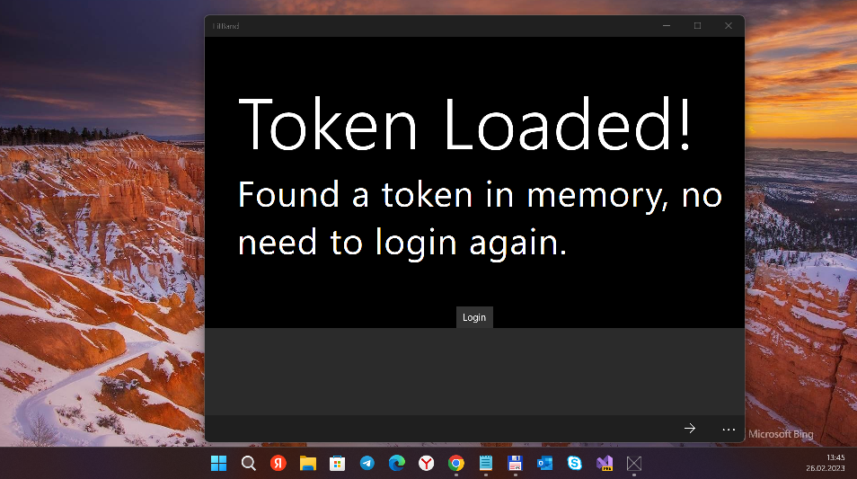

# MSB
I have not any Fitbit (Flex or similar) device. But... I'm interested in cool Fitbit "Cloud infrastructure"... ;)

## Idea 

I have Microsoft Band 2. MS Health "cloud service" damaged. 
My idea: synthez [MS]Band2 "front-end" with Fit[B]it "backend".

So, wouldn't it be cool to have the band's steps sync into the Fitbit service on MS Band? :)

## FitBit API access
If you want to try this out or rip parts of it out, just make sure you register with Fitbit 
as a developer and have your Client ID and Client Secret handy.

## Few tech. moments
- UWP "app class" used. 
- Min. os. win. switched to 14393. So, potential W10M compatibility persists (but I not "live tested" yet).

## ..
AS IS. No support.Proto only. DIY.

## .
[m][e] 2023
