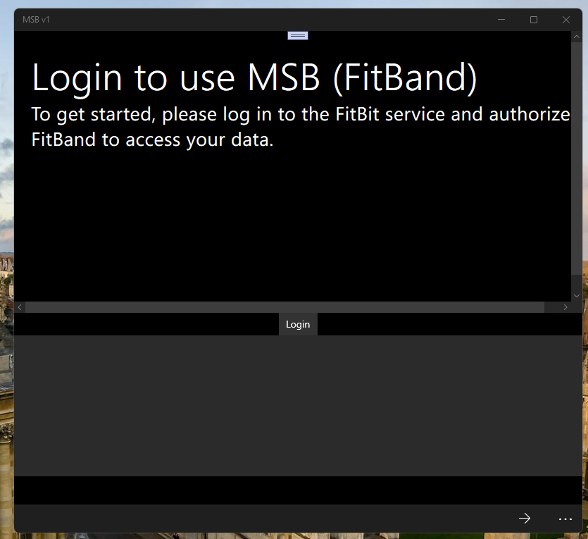

# MSB (FitBand codename)

I have not any Fitbit (Flex or similar) device. But... I'm interested in cool Fitbit "Cloud infrastructure" such as dev.fitbit.com... ;)

## Screenshots

## My Crazy Idea 
I have Microsoft Band 2. And I know that MS Health "cloud service" completly damaged. 
My idea: synthez [MS]Band2 "front-end" with Fit[B]it "backend".

So, wouldn't it be cool to have the band's steps sync into the Fitbit service on MS Band? :)

## FitBit API access
If you want to try this out or rip parts of it out, just make sure you register with [Fitbit](https://dev.fitbit.com) 
as a developer and have your Client ID and Client Secret handy.

## Few tech. moments
- UWP "app class" used. 
- Min. os. win. switched to 14393. So, potential W10M compatibility persists but not tested yet.

## References
- [Fitbit dev portal](https://dev.fitbit.com)
https://dev.fitbit.com/build/reference/web-api/ Fitbit Web API
- https://dev.fitbit.com/build/reference/web-api/activity/get-daily-activity-summary/ How to retrieve a summary of the user's activity for a specific date (January, 10 2025 hardcoded by me)))
- https://github.com/Fitbit/sdk-oauth How to add your own "credentials" 

## ..

AS IS. No support. Proto only. DIY.

## .

[m][e] 

January, 10 2025
